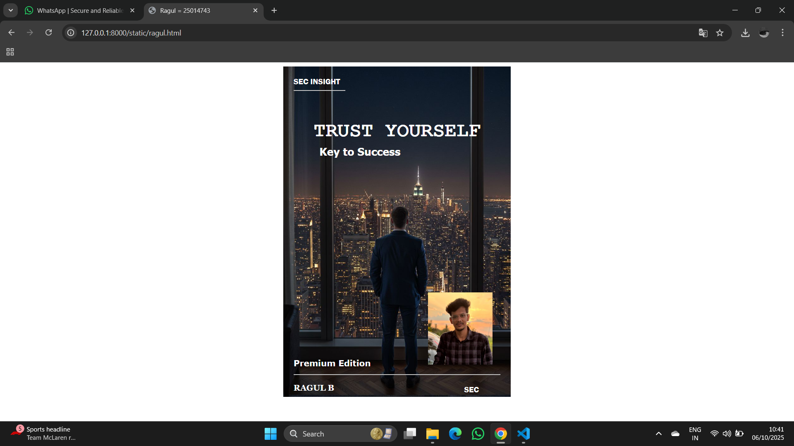

# Ex.06 Book Front Cover Page Design
## Date:06/10/2025

## AIM:
To design a book front cover page using HTML and CSS.

## DESIGN STEPS:

### Step 1:
Create a Django Admin project.

### Step 2:
Create an app in the Django interface.

### Step 3:
Create a folder named 'static' in the app folder.

### Step 4:
Create a new HTML file in the static folder.

### Step 5:
Write the HTML code with relevant CSS properties.

### Step 6:
Choose the appropriate style and color scheme.

### Step 7:
Insert the images in their appropriate places.

### Step 8:
Publish the website in the LocalHost.

## PROGRAM:
```
ragul.html
<html>
     <head>
           <meta name="viewport"
           content="width=device-width, initial-scale=1.0">
           <link rel="stylesheet" type="text/css" href="style.css">
            
           
            <title>Ragul = 25014743</title>
     </head>
         <body >
            <div class="bookpage">
                 <div class="insight">
                      SEC INSIGHT
                 </div>
                 <div class="hrstyle">
                      <hr style="color: yellow;">
                 </div>
                 <div class="booktitle">
                      <h1>TRUST YOURSELF</h1></div>

                 <div class="subtitle">
                         <h3>Key to Success</h3>
                 </div>
                 <div class="mypic">
                      
                 </div>
                 
                 <div class="id">
                      <hr style="color: rgb(5, 5, 69);">
                 </div>
                 <div class="author">
                       <p><b>RAGUL B</b></p>
                 </div>
                 <div class="pub">
                       SEC
                 </div>
                 <div class="ed">
                      <b>Premium Edition</b>
                 </div>
             </div>
          </body>
       </html>
style.css
 .bookpage{
               width: 400px;
               height: 600px;
               color: white;
               margin-left: auto;
               margin-right: auto;
               padding: 20px;
               font-family: 'Franklin Gothic Medium', 'Arial Narrow',Arial, sans-serif;
               background-image: url(cover.jpg);
               background-size: cover;
           }


           .insight{
                color: white;

           }


           .hrstyle{
                width: 100px
           }
           .author{

               display: inline;
               position: relative;
               color: rgb(255, 255, 255);
               top: 300px;
              

               font-family:Georgia;
               font-size: bold;
            }
            .booktitle{
                font-family: 'Courier New', Courier,monospace;
                font-size: larger;
                text-align: center;
                position: relative;
                top: 30px;

            }
            .id {
                width:400px;
                position:relative;
                top:300px;

            }
            .pub{
                font-size: medium;
                position: relative;
                top:270px;
                left:330px;
            }
            .ed{
                color: white;
                font-size: medium;
                font-family: Verdana;
                position:relative;
                top:200px;
            
            }
            .subtitle{
                font-family: Tahoma;
                font-size: large;
                position: relative;
                left: 50px;
                top:10px;
            }
            .mypic{
                 position: relative;
                 top: 250px;
                 left: 260px;
                 width: 100px;
                 height: 100px;
                 background-size: cover;
             }       
```             

## OUTPUT:


## RESULT:
The program for designing book front cover page using HTML and CSS is completed successfully.
